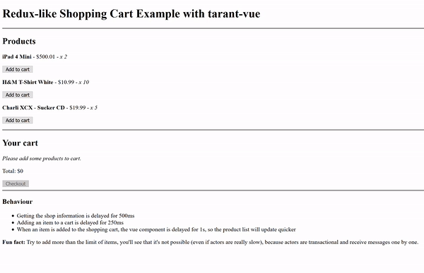

# shopping-cart-redux-vue

This example shows how to use redux-like patterns, like actions and reducers, using tarant and tarant-vue. The folder
structure is as in redux-like projects.

* *lib/actions* with the actions protocols and implementation
* *lib/components* with Vue components that subscribe to the store
* *lib/domain* with domain classes
* *lib/reducers* with reducers
* *lib/index.ts* with the dependency injection and bootstrap of the application

How to run
-----------

```sh
yarn install
yarn build

open dist/index.html
```

Showcase gif
------------


* Getting the shop information is delayed for 500ms
* Adding an item to a cart is delayed for 250ms
* When an item is added to the shopping cart, the vue component is delayed for 1s, so the product list will update quicker

**Fun fact:** Try to add more than the limit of items, you'll see that it's not possible (even if actors are really slow), because actors are transactional and receive messages one by one.